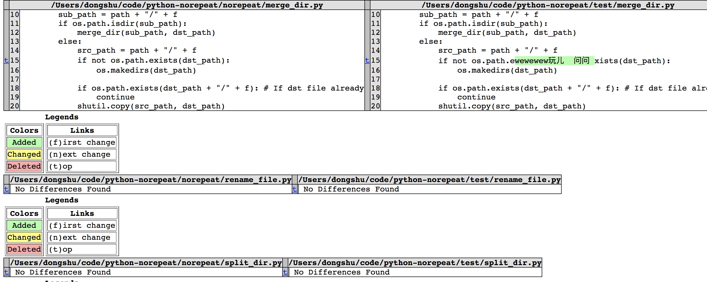

- [norepeat](#norepeat)
    - [Installation](#installation)
    - [norepeat package (Private-DEBUG)](#norepeat-package-private-debug)
    - [DOC](#doc)
        - [1.Count a project sum of codes number](#1count-a-project-sum-of-codes-number)
        - [2.Generate markdown menu automatically](#2generate-markdown-menu-automatically)
        - [3.Merge all dirs files to a same directory named 'merge'](#3merge-all-dirs-files-to-a-same-directory-named-merge)
        - [4.Split files to a new directory for same type](#4split-files-to-a-new-directory-for-same-type)
        - [5.Rename multiple file names](#5rename-multiple-file-names)
        - [6.Download http image](#6download-http-image)
        - [7.Compare dirs files](#7compare-dirs-files)
# norepeat

The [norepeat](https://pypi.org/project/norepeat/1.0.0/) package contains some magical function, it's my personal tools collection...

## Installation

You can install the Real Python Feed Reader from [PyPI](https://pypi.org/project/norepeat/):

```
pip install norepeat
```
The norepeat is supported on Python 3 and above.


## norepeat package (Private-DEBUG)
https://pypi.org/project/norepeat/1.0.0/

TEST:
* python3 setup.py sdist bdist_wheel
* python3 -m twine upload --repository-url https://test.pypi.org/legacy/ dist/*
* pip install -i https://test.pypi.org/simple/ norepeat==1.0.0

* python -u __main__.py -h -a > a.txt

PROD:

* python3 setup.py sdist bdist_wheel

* twine upload dist/*


## DOC

### 1.Count a project sum of codes number
```
norepeat count_code_nums -h
```
```
usage: count_code_nums [-h] [-p PATH] [-t TYPE]

    Count summary codes lines/统计代码行数
    Eg:
        norepeat count_code_nums -p=project -t=py


optional arguments:
  -h, --help            show this help message and exit
  -p PATH, --path PATH  file/directory path
  -t TYPE, --type TYPE  file type
```
### 2.Generate markdown menu automatically
```
norepeat gen_markdown_menu -h
```
```
usage: gen_markdown_menu [-h] [-n NAME] [-p PREFIX]

    Generate markdown Menu(TOC(Table of Content)) automatically 生成Markdown TOC目录结构， 对###三层可以增加自动序号
    Eg:
        norepeat gen_markdown_menu -n=sample.md
        OR

    then you will get a sample_back.md with contents
    sample_back.md is new generated file including menu


optional arguments:
  -h, --help            show this help message and exit
  -n NAME, --name NAME  file name
  -p PREFIX, --prefix PREFIX
                        auto generate num prefix for menu
```
### 3.Merge all dirs files to a same directory named 'merge'
```
norepeat merge_dir -h
```
```
usage: merge_dir [-h] [-p PATH]

    Merge all dirs files to a same directory named 'merge'
    合并迭代所有目录文件夹， 将全部文件合并到merge文件夹下
    Eg:
        norepeat split_dir -p=test
        before:
            dir
                txt
                    txt2
                        c.txt
                    a.txt
                    b.txt
                png
                    a.png
                    b.png
        after:
            dir
                merge
                    a.txt
                    b.txt
                    c.txt
                    a.png
                    b.png


optional arguments:
  -h, --help            show this help message and exit
  -p PATH, --path PATH  dir path, use . for current dir
```
### 4.Split files to a new directory for same type
```
norepeat split_dir -h
```
```
usage: split_dir [-h] [-p PATH] [-r REMOVE]

    Split files to a new directory for same type 根据文件类型分离目录下文件到不同文件夹
    Eg:
        norepeat split_dir -p=test
        before:
            dir
                a.txt
                b.txt
                a.png
                b.png
        after:
            dir
                txt
                    a.txt
                    b.txt
                png
                    a.png
                    b.png


optional arguments:
  -h, --help            show this help message and exit
  -p PATH, --path PATH  dir path, use . for current dir
  -r REMOVE, --remove REMOVE
                        if remove src files, default is No
```
### 5.Rename multiple file names
```
norepeat rename_file -h
```
```
usage: rename_file [-h] [-d DIR_PATH] [-p PREFIX] [-s SUFFIX] [-r REMOVE]
                   [-i ID]

    Rename multiple file names 批量重命名
    Eg:
        norepeat rename_file -d=test -p=test -s=end -r=true -i=true
        before:
            dir
                a.txt
                b.txt
        after:
            dir
                testaend1.txt
                testbend1.txt


optional arguments:
  -h, --help            show this help message and exit
  -d DIR_PATH, --dir_path DIR_PATH
                        directory path
  -p PREFIX, --prefix PREFIX
                        new file name prefix
  -s SUFFIX, --suffix SUFFIX
                        new file name suffix
  -r REMOVE, --remove REMOVE
                        new file name with removing src name
  -i ID, --id ID        new file name need id
```

### 6.Download http image
```
norepeat download_img -h
```

```
usage: download_img [-h] [-u URL] [-n NAME]

    Download image to current directory 下载网络图片到本地目录
    Eg:
        norepeat download_img -u=https://test.png -n=test.png


optional arguments:
  -h, --help            show this help message and exit
  -u URL, --url URL     img url
  -n NAME, --name NAME  image name
```

### 7.Compare dirs files
```
norepeat diff_file -h
```

```
usage: diff_file [-h] [-p1 PATH1] [-p2 PATH2] [-d1 DIR_PATH1] [-d2 DIR_PATH2]

    Compare two files
    对比两个文件差异
    Eg:
        norepeat diff_file -p1=a.md -p2=b.md
    Compare all files that have same name in two dirs including recursive subdirs
    对比迭代所有文件夹下重名文件内容差异(可以跨文件目录搜索文件， 打包输出到一个result文件)
    Eg:
        norepeat diff_file -d1=python-norepeat/norepeat/ -d2=python-norepeat/test/


optional arguments:
  -h, --help            show this help message and exit
  -p1 PATH1, --path1 PATH1
                        file path
  -p2 PATH2, --path2 PATH2
                        file path
  -d1 DIR_PATH1, --dir_path1 DIR_PATH1
                        dir path
  -d2 DIR_PATH2, --dir_path2 DIR_PATH2
                        dir path

```

result:

